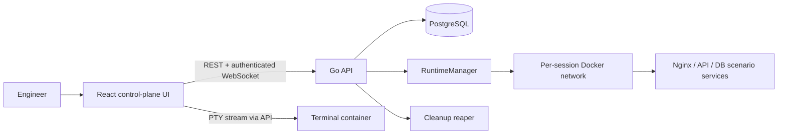

# KernelQuest architecture

KernelQuest separates the **control plane** from an isolated **runtime plane**. The Vite/React client is the control-plane UI. A Go API owns authentication, sessions, validation, scoring, auditing, and lifecycle orchestration. It creates an isolated Docker Compose project per incident session; the incident containers never receive the Docker socket or host mounts.

## Session lifecycle

`creating → provisioning → ready → running → completed → destroyed` is the normal path. `running → resetting → provisioning` creates a clean attempt, while `running → expired → destroyed` handles abandoned sessions. A state-machine package enforces legal transitions under a per-session lock; reset, submit, provision, and destroy are idempotent operations.

## Runtime and terminal

`RuntimeManager` is an interface implemented by Docker. It provisions a unique, internal-only network, applies CPU/memory/PID limits, and exposes no incident port to the host. The API attaches a PTY to the scenario’s terminal container and proxies byte streams only after authorization. Command metadata, never terminal secrets, is saved as an event.

## Scenario contract

Scenario YAML is loaded and schema-validated at boot, then seeded into PostgreSQL. It identifies a compose definition, setup/fault scripts, health checks, validation checks, three scored hints, and resource policy. Validation independently queries the runtime; the client cannot declare success.

## Data model

| Table | Key fields |
| --- | --- |
| users | id, email, password_hash, created_at |
| scenarios | id, slug, definition, version, enabled |
| incident_sessions | id, user_id, scenario_id, state, runtime_id, expires_at |
| terminal_events | id, session_id, command, occurred_at |
| incident_events | id, session_id, type, metadata, occurred_at |
| hint_usage | id, session_id, level, score_penalty |
| submissions | id, session_id, diagnosis, evidence, validated |
| scores | id, session_id, score, time_seconds, breakdown |

Indexes: `(user_id, state)` on sessions, `(session_id, occurred_at)` on all event tables, and unique `(slug, version)` on scenarios.

## API boundary

The API surface follows `/api/scenarios`, `/api/sessions`, `/api/sessions/{id}/reset`, `/api/sessions/{id}/hints`, `/api/sessions/{id}/submit`, and `/ws/sessions/{id}/terminal`. Every request validates session ownership before touching runtime state.

